# 「良いシーン切りぬく〜よ」UIデザイン参考資料

この文書は、UI実装時に参照する画像と、その画像から「参考にしてよいもの／してはいけないもの」を整理した資料である。

## 1. 最重要ルール

参考画像は **視覚デザイン・レイアウト・雰囲気の参考資料** であり、機能仕様ではない。

画像に描かれていても、`PRODUCT_SPEC.md` や `UI_SPEC.md` に存在しない機能は実装しない。

仕様・設計の優先順位は次の通り。

1. `../PRODUCT_SPEC.md`
2. `../UI_SPEC.md`
3. `../ARCHITECTURE.md`
4. `../DEVELOPMENT_RULES.md`
5. 本 `DESIGN_REFERENCE.md`
6. `../../reference-images/` の参考画像

画像同士で矛盾がある場合は、より新しい画像を自動的に正解扱いしない。必ず上位仕様に従う。

## 2. 全画像に共通して参考にする視覚要素

- macOSネイティブらしい明るい白・薄いグレー基調
- 青を主要操作色として使う
- 角丸カードと十分な余白
- 薄い境界線、控えめな影
- SF Symbolsに近いシンプルなアイコン
- 情報のまとまりが分かるカード分け
- 人物ごとの小さな色分け
- 結果・人物管理での左右分割レイアウト
- 文字サイズの階層を明確にし、主要操作を迷わせない
- 赤は停止・削除・エラー等に限定

## 3. 全画像に共通して機能仕様として採用しない要素

現行仕様では、以下を初期版に実装しない。

- 独立した設定画面
- 品質モード切替
- AI閾値のユーザー調整
- 全体進捗％
- 推定残り時間
- CPU使用率・メモリ使用率
- 一時停止
- バックグラウンド継続UI
- 解析中プレビュー
- 解析中タイムライン
- 音声波形
- 詳細リアルタイムログ
- AIの生スコアや「本人96%」のような表示
- 星5段階品質評価
- 録音による人物登録
- メモ・人物最終更新日時などの管理項目

---

## 4. 参考画像01：初期ダッシュボード案

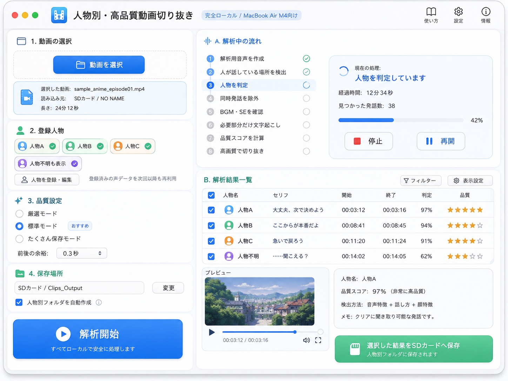

### 参考にする

- 白基調の大きなウィンドウ
- セクションをカードとして分ける考え方
- 青い主要ボタン
- 緑・オレンジ・紫などの人物色
- 結果一覧とプレビューを左右に分ける考え方

### 参考にしない

- 1画面に「動画選択・人物・品質設定・保存先・解析進捗・結果」を同時表示する構成
- 品質設定
- 保存先を解析前に必須表示
- 一時停止／再開
- 全体42％
- セリフ全文表示を必須とする構成
- 97%等の人物判定表示
- 星評価

現行UIでは、Home / Analysis / Results / Characters を分離する。

---

## 5. 参考画像02：人物管理の詳細案

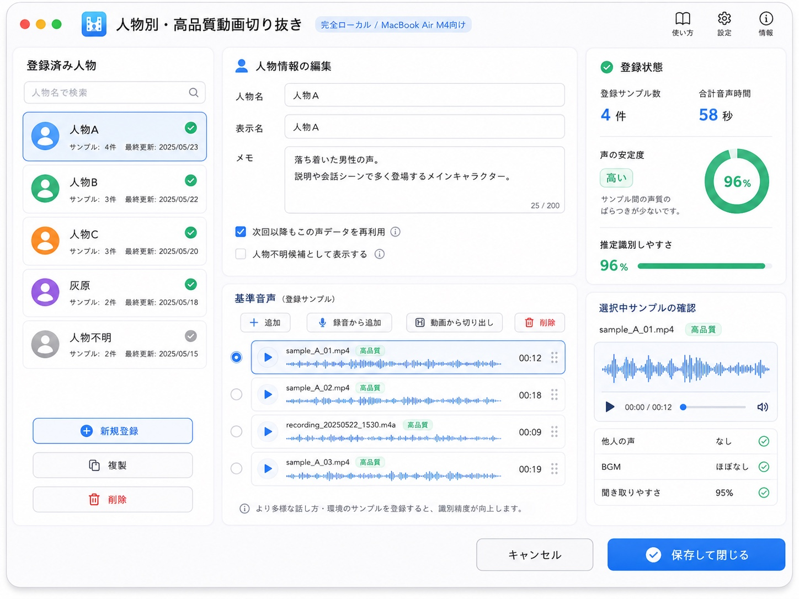

### 参考にする

- 左に人物一覧、右に選択人物の詳細を配置する構成
- 登録音声を行単位で並べる構成
- 選択中人物を薄い色で強調する表現
- 「音声を追加」「人物を削除」の位置関係

### 参考にしない

- 表示名と人物名の二重管理
- メモ欄
- 最終更新日時
- 「声の安定度96%」「推定識別しやすさ96%」等
- 波形表示
- 録音から追加
- 音声品質をAIが高品質と断定する表示

`CharactersView` の機能は `UI_SPEC.md` を優先する。

新規人物登録、既存人物への登録音声追加、人物削除は、それぞれ別の正式処理として扱う。参考画像の配置や共通部品だけを根拠に、同じトランザクションとして実装しない。

---

## 6. 参考画像03：旧設定画面案

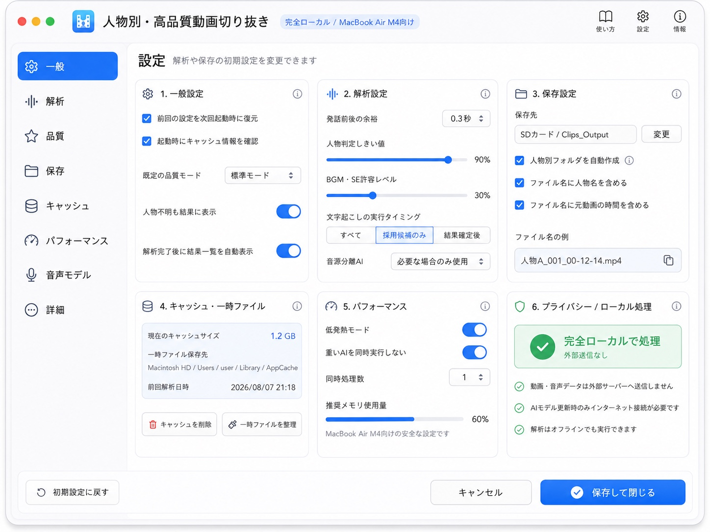

この画像は **色・余白・カード配置の参考のみ** とする。

### 参考にする

- macOSらしいサイドバーとカードの視覚表現
- 設定項目をカード単位で整理する余白感
- 青・緑の使い分け

### 実装しない

現行初期版では独立した設定画面を作らない。
この画像にある設定機能を根拠に実装を追加してはならない。

---

## 7. 参考画像04：旧解析中画面の詳細案

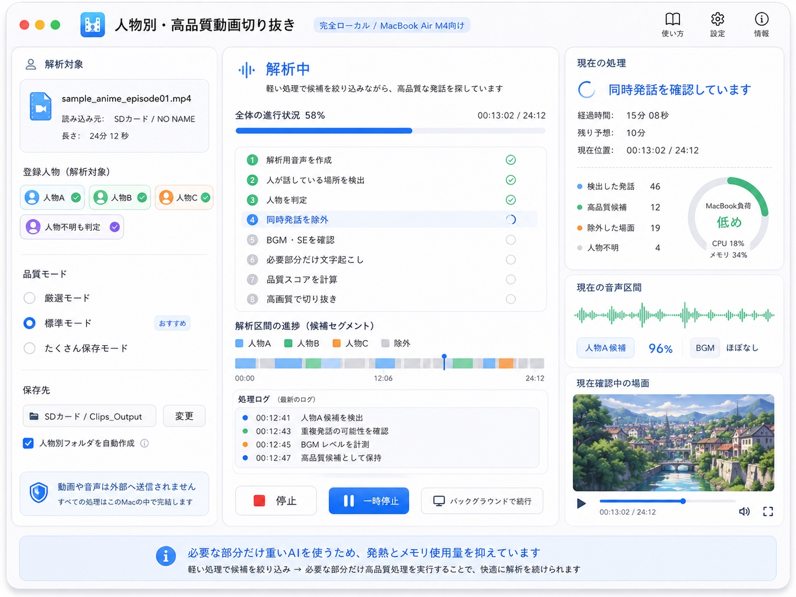

### 参考にする

- 現在工程を大きく見せる考え方
- 完了工程にチェックを付ける視覚表現
- 停止ボタンを明確に分離すること
- 情報密度をカードで整理する考え方

### 参考にしない

- 全体58％
- 残り予想
- CPU／メモリ
- 音声波形
- 解析中プレビュー
- 人物候補96％
- 詳細処理ログ
- 一時停止
- バックグラウンド継続

現行解析画面は5工程だけをシンプルに表示する。

停止要求中と停止完了は視覚的に区別する。ただし、停止完了を表す通信event形式や子プロセス停止方式は参考画像から決定しない。

---

## 8. 参考画像05：4主要画面の統一デザイン案

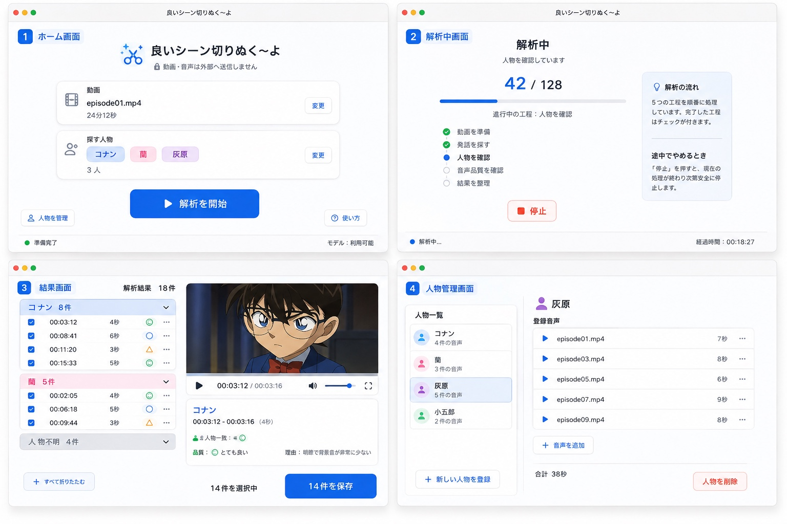

4主要画面の視覚的な統一感を考えるうえで有力な参考画像とする。

### Home

- タイトル、プライバシー文言、動画カード、人物カード、解析開始ボタンの構成を参考にする。
- 下部の状態表示は必要性を `UI_SPEC.md` で判断する。

### Analysis

- 大きな `42 / 128`
- 5工程
- 完了チェック／現在工程／未処理工程の視覚差
- 停止ボタン

を参考にする。

### Results

- 左に人物別候補一覧、右に動画プレビュー＋詳細
- 下部に選択件数と保存ボタン
- 人物不明を折りたたむ

を参考にする。

人物一致度と音声品質は別の概念として表示する。「人物不明」と「△ 要確認」を同じ状態として扱わない。

### Characters

- 左に人物一覧、右に登録音声
- 音声追加
- 人物削除

を参考にする。

---

## 9. 参考画像06：4主要画面の簡略案

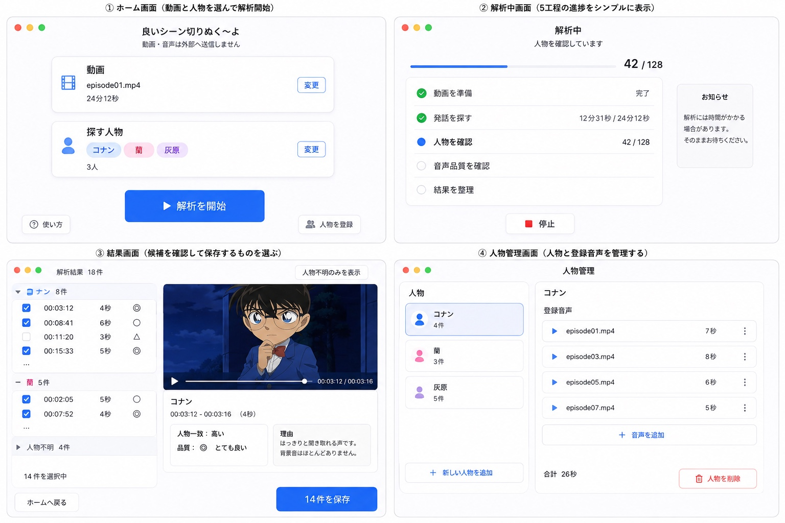

現行UIの「必要なものだけ見せる」という思想に近い参考画像。

### 特に参考にする

- Homeの情報量の少なさ
- Analysisの5工程表示
- Resultsの左右分割
- Charactersの単純な2ペイン構成
- 強すぎない装飾

### 注意

画像内にある機能・文言より `UI_SPEC.md` を優先する。

---

## 10. 参考画像07：新しい人物を追加

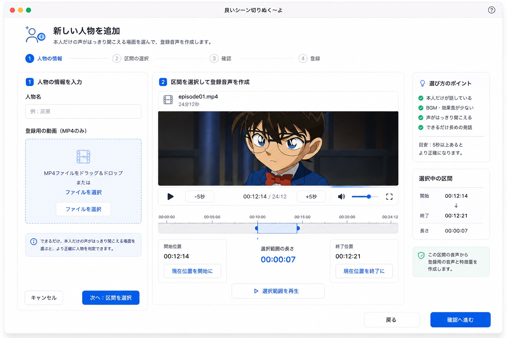

### 参考にする

- 人物登録を段階的に見せる考え方
- 左に人物名／動画選択、中央に区間選択、右に案内を置く視覚構成
- 本人だけの声を選ぶ案内
- 大きなプレビュー

### 注意

現行仕様では、高度な編集タイムラインを必須とはしない。
実装する操作は `UI_SPEC.md` の人物登録区間操作に限定する。

---

## 11. 参考画像08：区間の選択

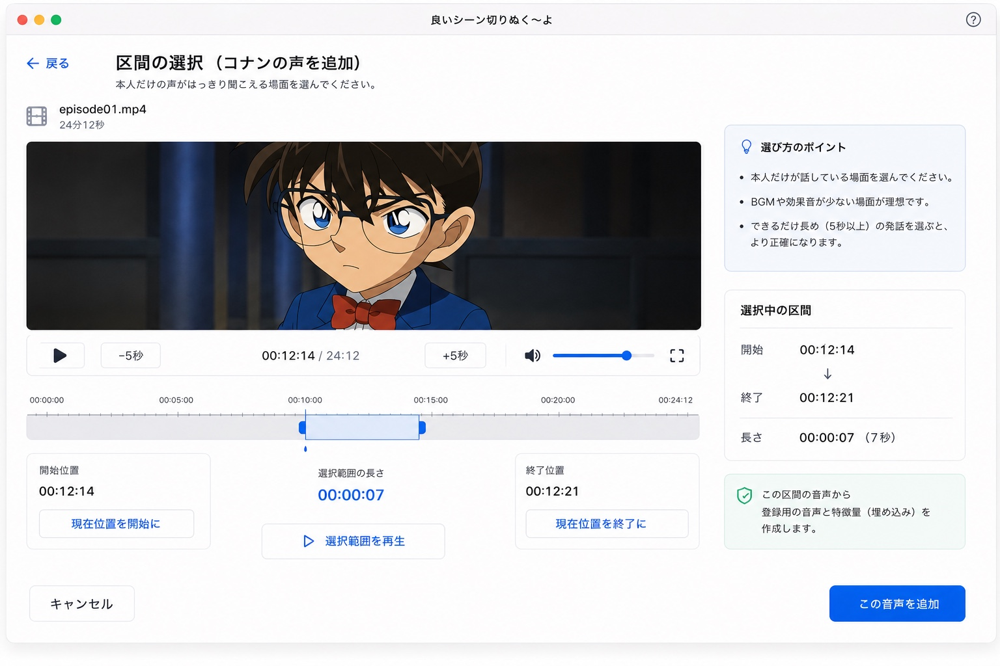

人物登録用の区間選択画面として、最も直接的な参考画像の1つ。

### 参考にする

- 大きな動画プレビュー
- `-5秒` / 再生 / `+5秒`
- 現在位置表示
- 開始位置と終了位置を別々に設定
- 選択範囲の長さを中央表示
- 選択範囲を再生
- 右側の選び方のポイント
- 最後に「この音声を追加」

### 実装上の注意

- 高度な動画編集UIに発展させない。
- 波形編集は作らない。
- 自動的に「本人だけ」と保証する文言は使わない。

---

## 12. 参考画像09：既存人物への音声追加

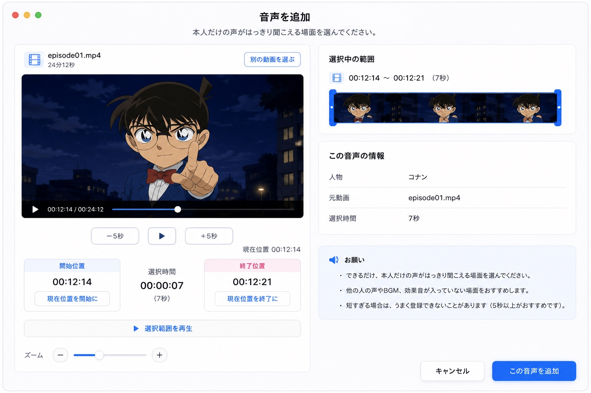

### 参考にする

- 左にプレビュー・範囲操作、右に選択情報を置く構成
- 開始／終了位置を明確に見せること
- 選択時間の表示
- 「本人だけの声」「他人・BGM・SEを避ける」という案内
- 最後の主要操作を青いボタンにする

### 参考にしない／必須にしない

- サムネイル帯
- ズーム操作
- 高度なトリム操作

初期版では、標準再生、±5秒、開始設定、終了設定、選択範囲再生を中心にする。

---

## 13. Codexが画像を使うときのルール

UI実装の依頼を受けた場合、Codexは次の順で確認する。

1. `AGENTS.md`
2. `docs/UI_SPEC.md` の該当画面
3. 必要なら `docs/ARCHITECTURE.md`
4. 本 `DESIGN_REFERENCE.md` の該当画像説明
5. 対応する `reference-images/*.jpg`

参考画像だけを見て機能を決めない。
参考画像から新しい設定・指標・ボタン・画面を勝手に追加しない。

見た目を再現するときも、SwiftUI標準部品とSF Symbolsを優先し、過度な独自コンポーネント化を避ける。

## 14. デザイン上の最終判断

迷った場合は、次の原則を優先する。

- 今必要な操作だけ見せる。
- 正常時は静かにする。
- 問題時だけ目立たせる。
- 処理中と完了を混同しない。
- AIの怪しい数字を出さない。
- 動画編集ソフトにしない。
- 便利さより、迷わなさ・壊れにくさを優先する。

---

# 追加参考画像（10〜15）

以下の画像も視覚デザインの参考資料として使用する。
**画像に描かれている機能や文言より、`PRODUCT_SPEC.md` と `UI_SPEC.md` の現行仕様を優先する。**
画像にしか存在しない機能は、仕様へ追加されたものと解釈してはいけない。

## 10. 新しい人物の登録完了画面

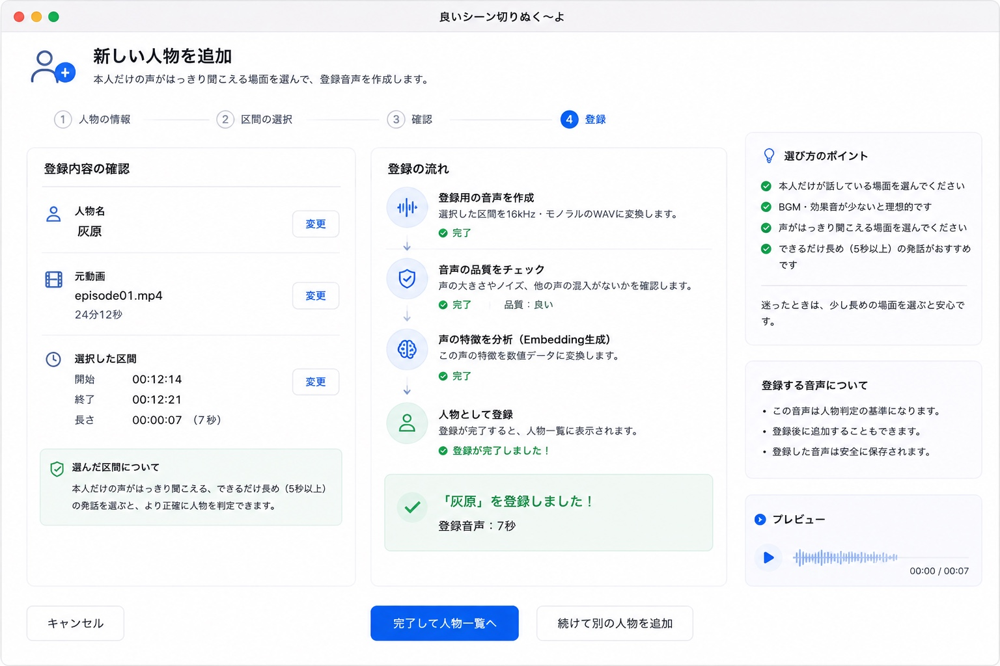

### 参考にする
- 登録処理の各段階を縦方向に整理する見せ方
- 「処理中」と「正式に登録完了」を明確に分ける考え方
- 登録内容の確認情報をカード単位で整理するレイアウト
- 成功時に緑を限定的に使うデザイン

### 注意
- UIで「完了」と表示するのは、登録音声・品質確認・Embedding生成・正式化がすべて成功した後だけ
- 技術用語は通常UIで必要以上に強調しない
- 波形表示は現行仕様で必須ではないため、画像だけを根拠に実装しない
- 複数sampleから人物判定用Embeddingを構成する方式は、画像から推測して決定しない

## 11. 新しい人物の登録・確認画面

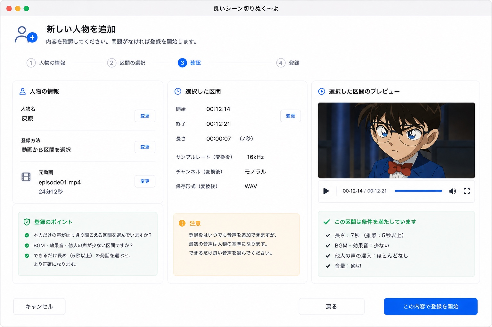

### 参考にする
- 人物名、元動画、選択区間を登録前に確認するレイアウト
- 選択区間をプレビューしてから登録開始できる流れ
- 注意事項を控えめなカードとして表示する方法

### 注意
- 「BGM・効果音が少ない」「他人の声がほとんどない」等を完全自動保証できるような表現は避ける
- 16kHz・モノラル・WAVなどの内部仕様は、ユーザーに常時見せる必要はない

## 12. 結果画面・全グループ折りたたみ状態

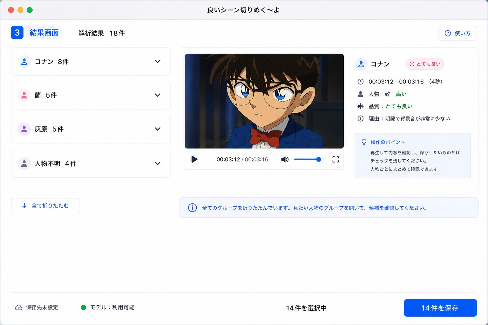

### 参考にする
- 人物ごとのグループを大きな行として折りたたむレイアウト
- 左側に人物グループ、右側にプレビューと候補詳細を置く構成
- 下部に選択件数と保存ボタンを固定する考え方
- 「全て折りたたむ」操作後の視覚状態

### 注意
- 人物一致度は「高い」「中程度」などの段階表示を使用し、生スコアや本人確率は表示しない
- 品質は現行仕様の「◎ とても良い / ○ 良い / △ 要確認」を優先する

## 13. 使い方画面

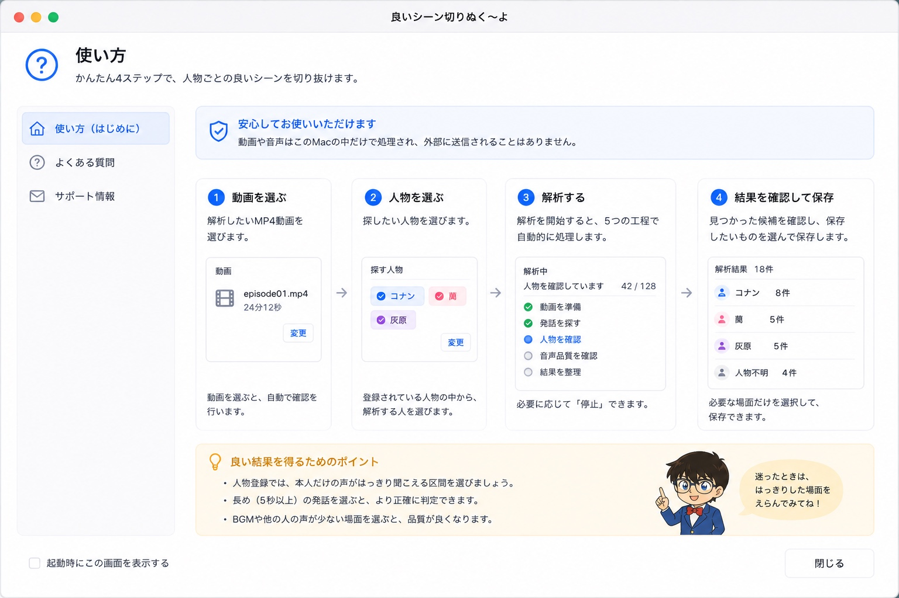

### 参考にする
- 「動画を選ぶ → 人物を選ぶ → 解析 → 結果を確認して保存」の流れを視覚化する考え方
- 完全ローカルであることを安心情報として簡潔に伝えるデザイン
- 初めて使う人でも流れが分かる余白の多い構成

### 注意
- 現行仕様では「使い方」は小さなSheetまたはPopover程度を基本とする
- この画像のような独立した大規模ヘルプ画面を、画像だけを根拠に実装しない
- キャラクターイラスト等の装飾素材は必須ではない

## 14. よくある質問画面

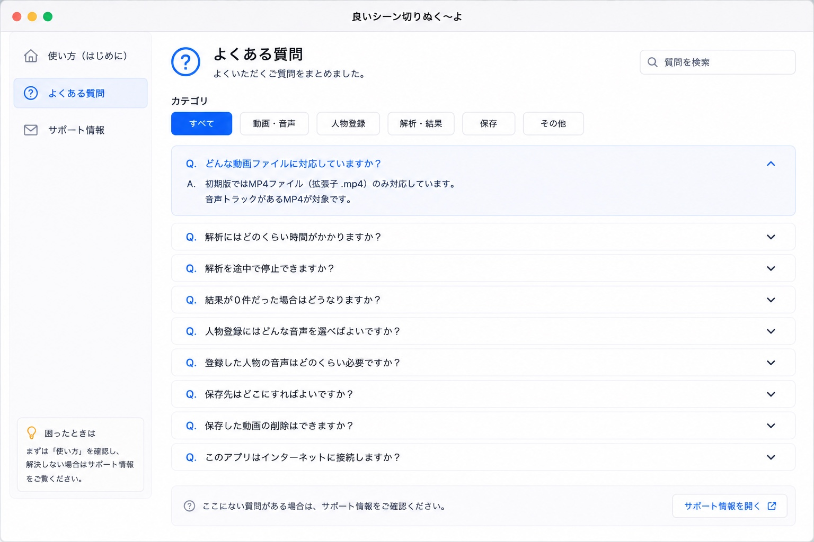

### 参考にする
- FAQを折りたたみ式で整理する視覚表現
- 質問と回答を簡潔に分ける情報設計
- 青をアクセントにした軽いヘルプUI

### 注意
- 初期版で独立FAQ画面を実装することは現行仕様の必須要件ではない
- 「サポート情報」や外部リンクを、仕様確認なしに追加しない
- 完全ローカル方針と矛盾する外部通信を追加しない

## 15. エラーとエラー分析画面

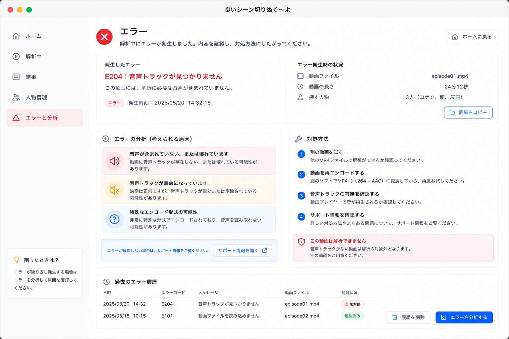

### 参考にする
- エラー内容と「次に何をすればよいか」を同時に示す考え方
- エラーを赤で明確にしつつ、画面全体を赤くしすぎないデザイン
- 技術例外そのものではなくユーザー向け日本語で説明する思想
- 原因候補と対処方法をカードで分離する情報設計

### 注意
- 初期版で「過去のエラー履歴」「エラー分析ボタン」「独立したエラー管理画面」を必須機能としない
- Pythonの例外文字列やFFmpegの生ログをそのまま表示しない
- Pythonからはエラーコードを返し、Swift側でユーザー向け文言へ変換する現行仕様を優先する
- エラー発生時には、原因の断定よりも安全な次の操作を優先して案内する
- partial、保存成果物の検証中、reconciliation中を「保存済み」と表示しない
- 既存完成MP4との衝突方式や保存ファイル名を参考画像から決定しない

---

## 参考画像全体に対する最終ルール

参考画像は、レイアウト、余白、カード、色、情報のグループ化、macOSらしい雰囲気を理解するために使用する。

**参考画像は機能仕様ではない。**

実装判断に迷った場合は次の優先順位に従う。

1. `docs/PRODUCT_SPEC.md`
2. `docs/UI_SPEC.md`
3. `docs/ARCHITECTURE.md`
4. `docs/DEVELOPMENT_RULES.md`
5. `docs/design/DESIGN_REFERENCE.md`
6. `reference-images/` の画像

下位資料だけに存在する機能を、上位仕様の確認なしに追加してはいけない。

参考画像内の外部リンク、サポート導線、クラウド機能等を根拠に外部通信を追加しない。初期版の完全ローカル方針を維持する。
